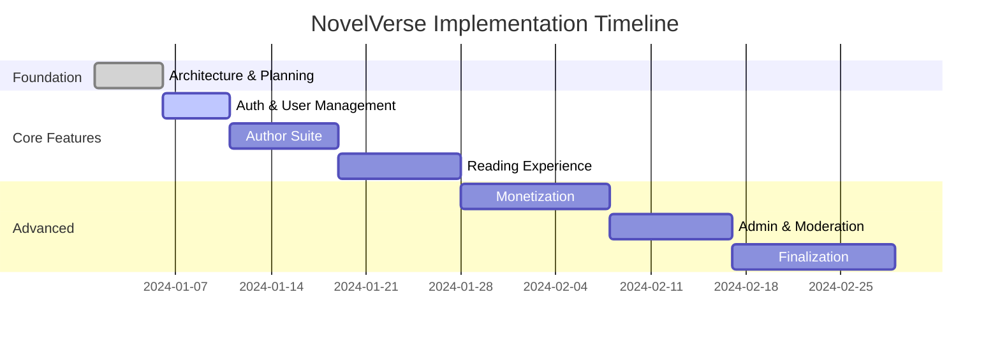

# 📦 NovelVerse - Deliverables Summary

  <b>Project Health & Status Overview</b> 
  
  

---

## 📑 Project Status Overview

| Component | Status | Completion |
| :--- | :--- | :---: |
| **Architecture & Planning** | ✅ Complete | 100% |
| **Backend (Supabase)** | ✅ Complete | 100% |
| **Core Android Structure** | ✅ Complete | 100% |
| **Documentation** | ✅ Complete | 100% |
| **Feature Implementation** | ⏳ Pending | 0% |
| **Testing** | ⏳ Pending | 0% |

---

## ✅ Delivered Components

### 1️⃣ Project Architecture
- **Master Blueprint**: `PROJECT_ARCHITECTURE.md`
- **Implementation Roadmap**: `PHASES.md`
- **Key Features**: Technology stack selection, module dependency diagram, and 25 implementation phases with timelines.

### 2️⃣ Supabase Backend
- **Database Schema**: `supabase/schema.sql`
- **Implemented**: 30+ tables with relationships, RLS policies for data protection, performance-optimized indexes, and seed data for genres, point packages, and achievements.

### 3️⃣ Android Project Structure
- **Core Configuration**: `build.gradle`, `settings.gradle`, and `AndroidManifest.xml`.
- **Environment**: Java 17 compatibility, Min SDK 24, Target SDK 34, and Firebase integration.

### 4️⃣ Core Application Code
- **Application Layer**: `NovelVerseApplication.java` with Firebase and background work scheduling.
- **Resources**: `strings.xml`, `colors.xml`, and Material 3 `themes.xml`.
- **Data Layer (Room)**: `NovelVerseDatabase.java`, entities for Novels, Chapters, Users, and progress tracking.
- **Dependency Injection**: Dagger Hilt modules for AppModule, DatabaseModule, NetworkModule, and RepositoryModule.

---

## 📊 Project Statistics

### Code Metrics
| Metric | Count | Description |
| :--- | :--- | :--- |
| **Java Files** | 25+ | Core classes, entities, and DAOs. |
| **XML Resources** | 3+ | Strings, colors, and themes. |
| **SQL Schema** | 1200+ | Total lines of database schema. |
| **Documentation** | 3000+ | Total lines of project documentation. |

### Database Metrics
| Metric | Count | Description |
| :--- | :--- | :--- |
| **Tables** | 30+ | User profiles, novels, chapters, etc. |
| **RLS Policies** | 50+ | Row-level security for data protection. |
| **Indexes** | 30+ | Performance-optimized data retrieval. |
| **Views** | 5+ | Common queries for analytics and reporting. |

---

## 🚀 Implementation Timeline

---

## 🛠️ Next Steps for Implementation

### 1️⃣ Immediate (Phase 3-4)
- Create Authentication UI (Login, Register, Forgot Password).
- Implement Supabase Auth integration.
- Create User Profile screens.

### 2️⃣ Short-term (Phase 5-10)
- Develop Author Dashboard and novel/chapter management.
- Build the reading experience with TTS support.
- Implement offline support and library system.

### 3️⃣ Medium-term (Phase 11-18)
- Build search and recommendation systems.
- Integrate social features (comments, follows).
- Implement Google Play Billing and AdMob.

---

  <b>Project Status: Foundation Complete - Ready for Feature Development</b> 
  Last Updated: 2024-01-01

