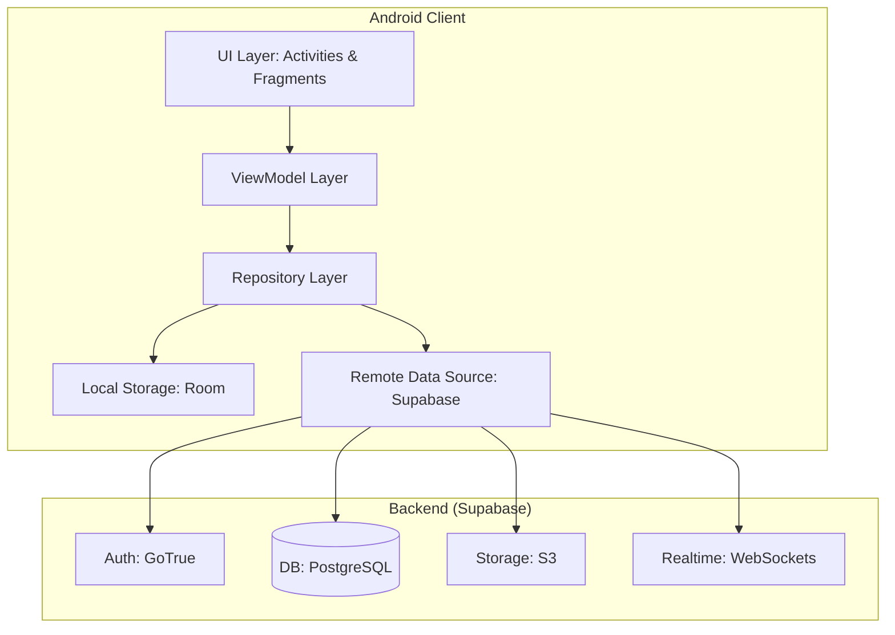

# 🏗️ NovelVerse Architecture & Implementation Guide

  <b>The Master Blueprint for a Production-Ready Novel Platform</b> 
  
  
  

---

## 📑 Executive Summary

**NovelVerse** is built on a clean, scalable, and maintainable architecture. It leverages the **MVVM (Model-View-ViewModel)** pattern on the Android client and a powerful **Supabase** backend to deliver a seamless user experience. This document serves as the master blueprint for the complete implementation.

---

## 🏛️ High-Level Architecture

---

## 🛠️ Technology Stack

### 📱 Android (Client)
- **Language**: Java 17
- **Architecture**: MVVM + Repository Pattern
- **Dependency Injection**: [Dagger Hilt](https://dagger.dev/hilt/)
- **Networking**: [Retrofit](https://square.github.io/retrofit/) & OkHttp
- **Database**: [Room](https://developer.android.com/training/data-storage/room)
- **Image Loading**: [Glide](https://github.com/bumptech/glide)
- **Asynchronous**: RxJava 3 / Coroutines
- **Monetization**: Google Play Billing & AdMob
- **Push Notifications**: Firebase Cloud Messaging (FCM)

### ☁️ Backend (Supabase)
- **Database**: PostgreSQL 15
- **Authentication**: GoTrue
- **Storage**: S3-compatible storage
- **Realtime**: WebSocket-based replication
- **Edge Functions**: Deno/TypeScript (optional)

### 🛡️ Third-Party Services
- **Firebase**: Crashlytics, Analytics, FCM
- **Google Cloud**: Vision API, Perspective API (moderation)
- **AdMob**: Rewarded & Banner ads

---

## 📂 Project Structure

| Package | Purpose |
| :--- | :--- |
| **`data/`** | Repositories, local database (Room), and remote API sources (Supabase). |
| **`domain/`** | Pure Java models, use cases, and business logic. |
| **`presentation/`** | UI components (Activities, Fragments) and ViewModels. |
| **`di/`** | Dagger Hilt modules for dependency injection. |
| **`services/`** | Background services like TTS, Download, and FCM. |
| **`workers/`** | WorkManager tasks for background sync and cleanup. |
| **`billing/`** | Google Play Billing integration and product management. |
| **`moderation/`** | Content filtering and reporting logic. |

---

## 🔒 Security Architecture

NovelVerse prioritizes user data protection through a multi-layered security approach:

1. **Certificate Pinning**: OkHttp certificate pinner for secure Supabase communication.
2. **Root Detection**: SafetyNet/Play Integrity API to ensure a secure device environment.
3. **Encryption**: `EncryptedSharedPreferences` for sensitive user data.
4. **Obfuscation**: ProGuard/R8 rules to prevent reverse engineering.
5. **RLS Policies**: Row Level Security on all Supabase tables for data access control.
6. **Input Validation**: Rigorous client and server-side validation.

---

## 📊 Performance Targets

| Metric | Target | Description |
| :--- | :--- | :--- |
| **Cold Start** | < 2.0 seconds | Time from app launch to main screen. |
| **Offline Load** | < 1.0 second | Time to load cached content without network. |
| **App Size** | < 50 MB | Total APK/AAB size. |
| **API Response** | < 500ms | Average latency for API requests (cached). |
| **Image Load** | < 300ms | Time to render images from Glide cache. |
| **Crash-Free Rate** | > 99.5% | Target stability for production builds. |

---

## 🚀 Critical Implementation Paths

1. **Auth Flow**: Guest Mode → Registration/Login → Data Synchronization.
2. **Reading Flow**: Browse → Detail → Reader → Reading Progress Sync.
3. **Payment Flow**: Store → Purchase → Verification → Access Grant.
4. **Author Flow**: Dashboard → Create Novel → Add Chapters → Publish.

---

  <b>Total Estimated Duration: 65 Days</b> 
  For more details, check out <a href="PHASES.md">Implementation Phases</a>

